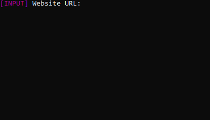

# Bird Glance

## About

  **Version Number: Beta 1.4.1**

  Gets basic information on the Uniform Resource Locator (URL) provided by the user and outputs 
  the results in a .txt format.

  This was one of my first python projects of this nature, so I apologise for
  any unsightly code to remedy this I plan on doing a full rewrite in the future.

## Installation

In the terminal of your choice:

Install files from GitHub:

    git clone https://github.com/BirdsAreFlyingCameras/BirdGlance

Travel to the path of installation:

    cd [Path to script]

Then install the requirements:

    pip install -r requirements.txt

## Usage

In the terminal of your choice:

Travel to the path of installation:

    cd [Path to script]

Then to run the script:

    python3 main.py

## Examples

| OS             | Output                                         |
|----------------|------------------------------------------------|
| Windows 10     |  |
| Linux (Ubuntu) |      |

## Methods

  This script employs several methods and techniques to gather and process information about a website. Here's an overview of the key methods used:
  
  **HTTP Requests (requests library):**
  
  **Fetching TLDs:** 
  
  The script uses requests.get to retrieve a list of valid Top-Level Domains (TLDs) from the Internet Assigned Numbers Authority (IANA). This is used to validate the TLD of the input URL.
  

  **Website Status Checks:** 
  
  The script makes HTTP and HTTPS requests to the input URL to check if the website is accessible under both protocols.

  **URL Parsing (urllib.parse):**
  
  Extracting Hostname: The urlparse method from the urllib.parse module is used to parse the input URL and extract the hostname, which is essential for IP resolution and further information gathering.

  **DNS Resolution (socket library):**
  
  Resolving IP Address: The script uses the socket.gethostbyname method to resolve the domain name (extracted hostname) to its corresponding IP address.

 **JSON Handling (json library):** 
  
  Processing API Responses: For gathering geographical and ISP information, the script makes requests to the IP-API service and then uses the json library to parse and process the JSON responses.

  **String Manipulation:**
  
  URL Refactoring: The script manipulates strings to ensure the URL is in the correct format for HTTP and HTTPS requests.

  Data Formatting: Extracted data is formatted and cleaned up (removing special characters, unnecessary JSON formatting, etc.) for output.

  **File Handling:**
  
  Writing to Text File: The script writes the gathered information into a text file, allowing for persistent storage and easy sharing of the results.
  
  **Conditional Logic and Loops:**
  
  Validation Checks: The script contains several conditional statements and loops to validate the URL, check if it ends with a valid TLD, and determine if it's an IP address.

  **Error Handling:**
  
  While the script includes some basic error checks (like validating TLDs), it lacks comprehensive exception handling,
  especially for potential errors in network requests or DNS lookups this is an issue actively being worked on and will be resolved soon.

  **User Interface (PyEnhance):**
  
  Colored Output and Stamps: The script uses PyEnhance for decorative stamps to enhance user interaction in the console.

  
  Overall, the script combines network programming, API interactions, data parsing, and file operations to create a utility for website information retrieval.

## Libraries used

| Library      | Usage                       |
|--------------|-----------------------------|
| urllib.parse | Host name resolution        |
| json         | Making API request          |
| PyEnhance    | CLI output decorations      |
| Requests     | Web requests                |
| socket       | Resolving a URLs IP address |
| sys          | Stopping the script         |

## APIs Used

**IP-API**  
***Website:*** *[ip-api.com](https://ip-api.com)*  
***API Key Required:*** *No*  

Thank you to the people that run ip-api.com for providing their API 
free of charge and registration. 
